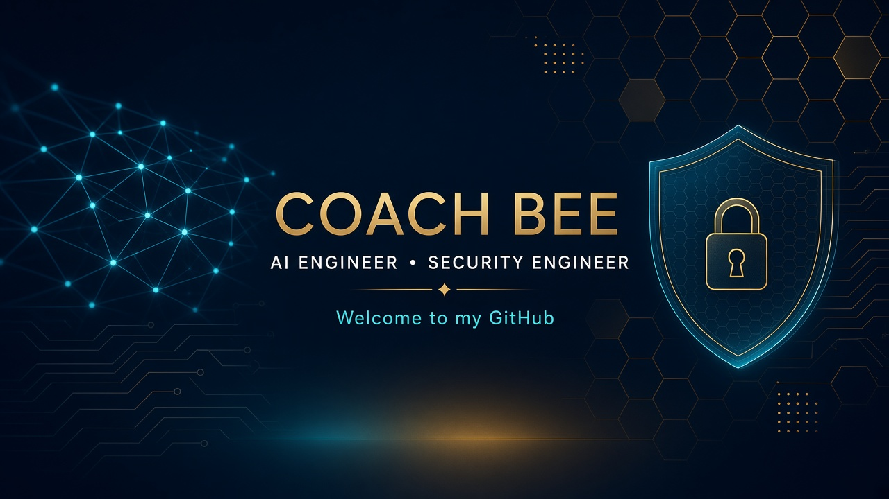
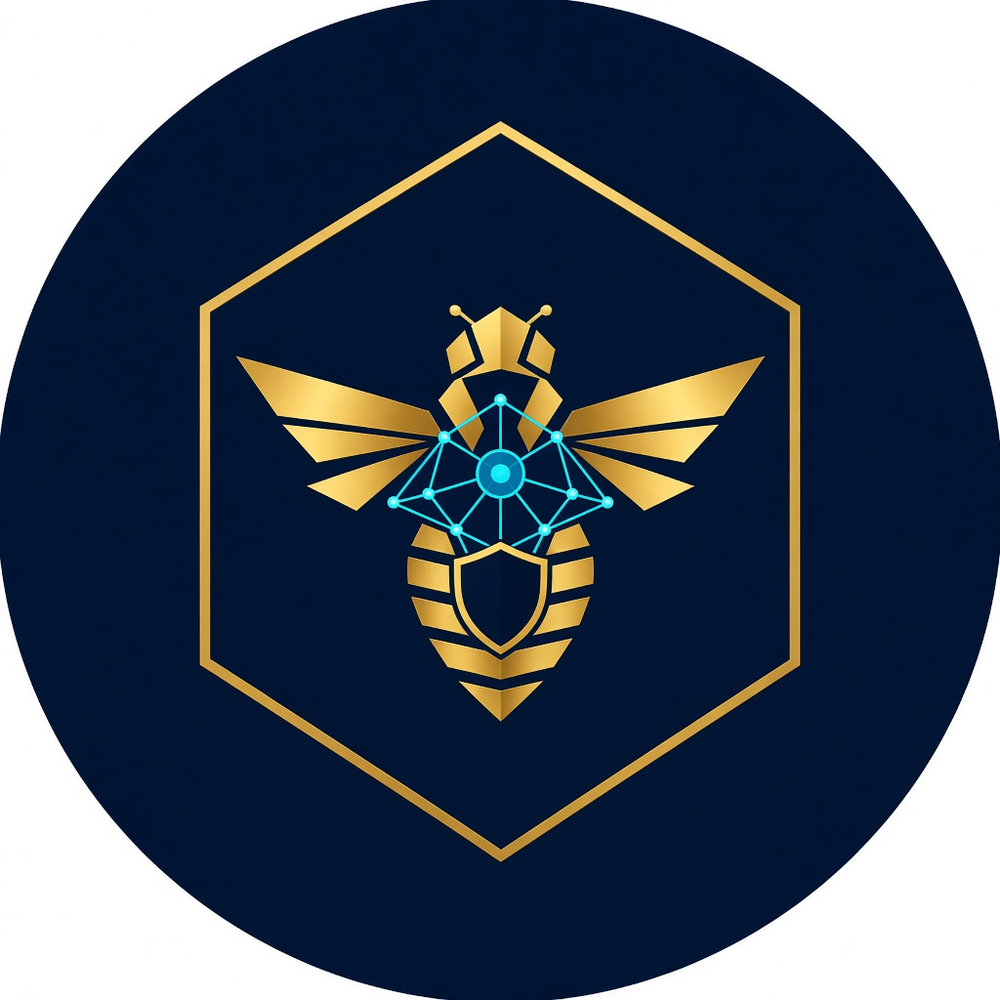

  
   
  

  # Welcome to my GitHub

  **I'm Temi (Coach Bee)** — an **AI Engineer** and **Security Engineer**.  
  I design agentic systems, ship them on cloud-native platforms, and harden the path from idea to production.

  

    
  

  

    
    
    
  

---

## Who I am

I sit at the intersection of **intelligent systems** and **trusted infrastructure**.

As an **AI Engineer**, I build assistants and agents that can retrieve knowledge, use tools, and operate with memory — not just chat. That includes RAG pipelines, MCP-style tool wiring, LangChain/ADK experiments, and delivery workflows that turn requirements into working software.

As a **Security Engineer**, I treat every AI and cloud path as a threat surface: secrets, identity, cluster policy, observability, and least privilege. Pretty demos are not enough. If it cannot be monitored, locked down, and recovered, it is not ready.

I also work as a **cloud / platform builder** — AWS, Azure, Kubernetes, GitOps with Argo CD, Terraform, and CI/CD — so the models and agents I ship have a real home.

---

## What I care about

| AI Engineering | Security Engineering |
| --- | --- |
| Agentic workflows that take action, not just generate text | Secrets never in git; identity and access by default |
| RAG with grounded sources and honest failure modes | Kubernetes, GitOps, and supply-chain hygiene |
| Tool use (MCP, APIs, internal docs) with clear contracts | Monitoring, audit trails, and runtime visibility |
| Human-in-the-loop where the blast radius is high | Simple controls people will actually follow |

**Philosophy:** technology is most useful when it is simple, scalable, and **safe to run**.

---

## Toolkit

  

 

  
  
  
  
  
  
  
  
  

---

## Featured work

Public snapshots of how I think and build. Come look around.

| Project | Why it is here |
| --- | --- |
| [ollama_rag_streamlit](https://github.com/CoachBeeBest1/ollama_rag_streamlit) | Local-model RAG with a UI — grounded Q&A, not vibes |
| [friendchat](https://github.com/CoachBeeBest1/friendchat) | Cloud-native app on AKS: Docker, GitOps, Prometheus, Grafana |
| [k8s-argocd-bee-project](https://github.com/CoachBeeBest1/k8s-argocd-bee-project) | Retail-style service on Kubernetes with Argo CD |
| [rag](https://github.com/CoachBeeBest1/rag) | A clean RAG baseline |
| [MCP-DEMO](https://github.com/CoachBeeBest1/MCP-DEMO) | Model Context Protocol experiments for tool-using agents |
| [google_adk](https://github.com/CoachBeeBest1/google_adk) | Agent development kit playground |
| [my-k8s-infra](https://github.com/CoachBeeBest1/my-k8s-infra) | Azure Kubernetes infrastructure as code |

---

## Currently building

- Agentic assistants with tools, memory, and eval-minded design
- Knowledge agents and delivery toolkits that tighten the loop from intent to ship
- CloudOps patterns where **AI + security + platform** stay in the same conversation

---

## Pulse

 

---

## Make yourself at home

You are welcome here — whether you arrived for **agents**, **RAG**, **Kubernetes**, or **secure delivery**.

Clone something. Open an issue. Challenge an idea. If you are building AI that has to live in the real world (identity, secrets, clusters, humans), we will have plenty to talk about.

**Let's build systems people can trust.**

Temi · Coach Bee · AI Engineer · Security Engineer

